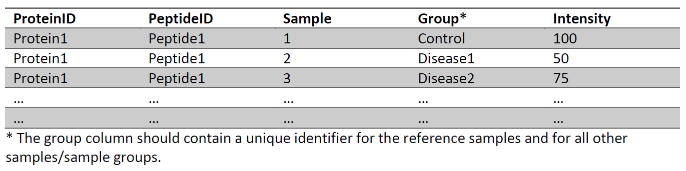
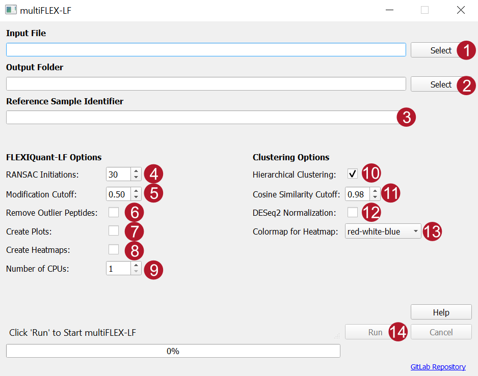
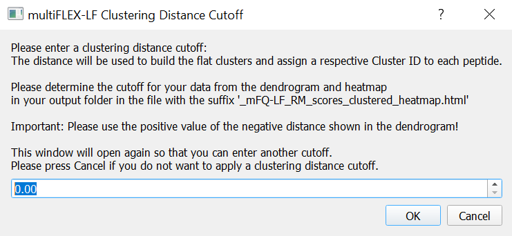

# multiFLEX-LF

In high-throughput LC-MS/MS-based proteomics information about the presence and stoichiometry of post-translational are normally not readily available. Here we introduce multiFLEX-LF, a computational tool that overcomes this problem. The tool build upon the tool FLEXIQuant-LF (https://github.com/SteenOmicsLab/FLEXIQuantLF). FLEXIQuant-LF was developed to analyze a single protein to identify differentially modified peptides and quantify their modification extent. multiFLEX-LF analyzes all proteins of given dataset consecutively (on 1 core) or in parallel employing multiple cores/threads. multiFLEX-LF requires label-free quantification of unmodified peptides and a within study reference (e.g., a reference time point or control group). multiFLEX-LF employs random sample consensus (RANSAC)-based robust linear regression to compare a sample to a reference and compute a relative modification (RM) score. A low RM score corresponds to a high differential modification extent. The peptides are hierarchically clustered based on the RM scores. The clustering which is saved in an interactive dendrogram and heatmap can be investigated for groups of peptides with similar modification dynamics. multiFLEX-LF is unbiased towards the type of modification. Hence, multiFLEX-LF drives large-scale investigation of the modification extent and the modification stoichiometries of peptides in time series and case-control studies. multiFLEX-LF was implemented in python and comes with a CLI and a GUI version.

## Download and Installation of the GUI
### Requirements
Windows 10 and 800MB of free disk space.

### Download GUI
multiFLEX-LF GUI executable for Windows 10 systems as well as the Python source code can be downloaded here: https://gitlab.com/SteenOmicsLab/multiflex-lf

## Installation
No installation needed. Just move the zip file to your location of choice and extract it. To start the program, double-click multiFLEX_LF_GUI.exe. The program might take a while to start.

## Getting Started
### Input format
multiFLEX-LF requires a comma separated file (.csv) containing unique protein and peptide identifier, sample and sample group identifier and the peptide intensities in the following format as input. The columns must have the same header as shown below:\

A test dataset is available here: https://gitlab.com/SteenOmicsLab/multiflex-lf/-/tree/main/scr/test_data

### Output
multiFLEX-LF creates the following output files:\
\*\* Prefix of the input file
- **\*\*_mFQ-LF-output_raw_scores.csv:**\
This file contains the calculated raw scores for all peptides of all proteins. Additionally, the following columns are included:
    - Slope: Slope of the regression line of the best linear regression model
    - R2 model: Coefficient of determination of the best linear regression model (calculated only using inliers as determined by RANSAC)
    - R2 data: Coefficient of determination of the best linear regression model (calculated using all data points)
- **\*\*_mFQ-LF-output_RM_scores.csv:**\
This file contains the calculated relative modification (RM) scores for all peptides of all proteins. RM scores are equivalent to one minus the modification extent.
- **\*\*_mFQ-LF-output_diff_modified.csv:**\
This file states for each peptide of all proteins if it was classified as differentially modified based on the user-defined modification cutoff (True) or not (False)
- **\*\*_mFQ-LF-output_removed_peptides.csv:**\
This file lists the peptides that were remove by raw score filtering i.e., peptides with a raw score higher than the median raw score of the sample plus three times the median absolute deviation of all raw scores of the sample are removed. These peptides are only removed from further analysis if the parameter Remove Outlier Peptides (CLI: --remove_outliers) is checked. The file also contains peptides without any intensities in the reference samples and proteins with less than five peptide intensities in all samples, which are removed from the analysis.
- **\*\*_mFQ-LF-output_regression_plots.pdf (optionally):**\
The file contains a linear regression plot for each sample and for each protein. These can be used as quality control to check if the linear regression line was fitted correctly.
- **\*\*_mFQ-LF_scatter_plots.pdf (optionally):**\
The file contains, for each protein, a scatter plot of the peptide intensities vs. the RM scores for all samples together. These can be used as quality control.
- **\*\*_mFQ-LF_heatmaps.pdf (optionally):**\
The file contains a heatmap of the RM scores of the peptides over the samples for each protein. These can be used investigate modification dynamics of protein of interest.
- **\*\*_mFQ-LF_RM_scores_distribution.pdf:**\
The file contains a histogram of the distribution of the RM scores of all peptides of all proteins in each sample for each sample group. These can be used as quality control.
- **\*\*_mFQ-LF_RM_scores_clustered_heatmap.html (optionally):**\
This file contains the interactive dendrogram and heatmap computed with hierarchical clustering. Can be opened in any internet browser. Zooming in and out is supported as well as saving screenshots of the figure. The heatmap cells show hover information about the respective protein ID, peptide ID and sample. Additionally, an ID number is shown, which corresponds to the rank of the peptide in the ordering of the clustering.
- **\*\*_mFQ-LF_RM_scores_clustered.csv (optionally):**\
File of the RM scores of the peptides in the order of the clustering. The file contains the ID number, protein ID, peptide ID and the RM scores of the corresponding peptide per sample.

### Parameters
\
Numbering of the input parameters as shown in the graphical user interface.\

The CLI parameters are written in square brackets.

**Required Parameters:**
- **Input File (1):** Path to input file \[--input_file/-i\]
- **Output Folder (2):** Path to output folder \[--output_folder/-o\]
- **Reference Sample Identifier (3):** Based on this, multiFLEX-LF determines the sample(s) to use as reference sample(s). This needs to exactly match the value in the "Group" column for all samples that should be taken as reference. If more than one sample is given (e.g., in case of a control group) multiFLEX-LF calculates the median intensity over all reference samples for each peptide. \[--reference/-r\]

**multiFLEX-LF Options:**
- **RANSAC Initiations (4):** Number of times multiFLEX-LF/FLEXIQuant-LF fits a new RANSAC linear regression model to each sample to choose the best model. Between 5 and 100 initiations can be selected. The more initiations, the higher the reproducibility and the probability that multiFLEX-LF/FLEXIQuant-LF finds the optimal model. However, choosing a high number can significantly increases the runtime and more than 50 initiations rarely provide additional benefit. Default: 30 \[--num_init/-n\]
- **Modification Cutoff (5):** RM score cutoff used to classify peptides as differentially modified. Default: 0.5 \[--mod_cutoff/-mc\]
- **Remove Outlier Peptides (6):** If checked peptides with an outlier raw score above a computed cutoff are removed before RM score calculation. If not checked, the outlier raw score is only removed for the specific sample, raw scores of the peptide of all other samples are kept for RM score analysis. \[--remove_ouliers/-rem\]
- **Create Plots (7):** If checked a linear regression plot for each sample and a scatter plot is created for each protein. All regression and scatter plots will be saved in a pdf file (_mFQ-LF-output_regression_plots.pdf and _mFQ-LF_scatter_plots.pdf). Warning: This option only works with 1 CPU core! \[--create_plots/-p\]
- **Create Heatmaps (8):** If checked a heatmap of the RM scores of the peptides over the samples is created for each protein. All plots will be saved in a single pdf file (_mFQ-LF_heatmaps.pdf). \[--create_heatmaps/-hmap\]
- **Number of CPUs (9):** Number of CPUs/threads used for multiFLEX-LF computation. Can be 2 times the number of available CPUs. Warning: This number should be lower than the maximum number of available CPUs/threads, otherwise the computer might freeze! \[--num_cpus/-cpu\]

**Clustering Options:**
- **Hierarchical Clustering (10):** If checked, computes a hierarchical clustering of the peptides based on their RM scores over the samples. Results of the clustering are visualized in an interactive dendrogram and heatmap. This is saved in a html file, which can be opened in any common internet browser. \[--clustering/-c\]
- **Cosine Similarity Cutoff (11):** Cutoff score for the cosine similarity for missing RM scores imputation for the clustering. Missing values of a peptide are imputed based on the median of the RM scores of the closest peptides to that peptide. The cosine similarity is computed to find all peptides with similarity above the given cosine similarity cutoff. Default: 0.98 \[--cosine_similarity/-cos\]
- **Deseq2 Normalization (12):** If checked, the RM scores are normalized after imputation employing DESeq2. Normalization is computed for each given sample group separately. Therefore, it has no effect if sample groups contain less than 2 samples. The peptides are clustered based on the DESeq2 normalized RM scores. \[--deseq2_normalization/-dn\]
- **Colormap for Heatmap (14):** A selection of color scales which can be chosen to create the interactive heatmap. \[--colormap/-cm\]

\
**Clustering Distance Cutoff:** The input window is opened after clustering was computed. The dendrogram and heatmap can then be investigated and a cutoff can be chosen for building flat clusters from the hierarchical clustering. All peptides with a clustering distance smaller than the given threshold are in the same flat cluster. The flat clusters are shown color-coded in a new interactive dendrogram and heatmap. The input window is shown repeatedly until canceled.

## multiFLEX-LF CLI

Run the following: (non-essential options in brackets, please remove them before execution!)\
`multiFLEX_LF_CLI.exe --input_file "example.csv" --output_folder "output/" --reference "control" [--clustering] [--deseq2_normalization] [--num_init 30] [--mod_cutoff 0.5] [--cosine_similarity 0.98] [--create_plots] [--create_heatmaps] [--remove_outliers] [--num_cpus 2] [--colormap 1]`

With abbreviated parameters:\
`multiFLEX_LF_CLI.exe -i "example.csv" -o "output/" -r "control" [-c] [-dn] [-n 30] [-mc 0.5] [-cos 0.98] [-p] [-hmap] [-rem] [-cpu 2] [-cm 1]`

Run the following to show help massage and information about the parameters:\
`multiFLEX_LF_CLI.exe -h`

For run time reasons, if the CLI should be applied many times consecutively, it is better to install the required packages and run the python script as follows (non-essential options in brackets, please remove them before execution!):\
`python multiFLEX_LF_CLI.py --input_file "example.csv" --output_folder "output/" --reference "control" [--clustering] [--deseq2_normalization] [--num_init 30] [--mod_cutoff 0.5] [--cosine_similarity 0.98] [--create_plots] [--create_heatmaps] [--remove_outliers] [--num_cpus 2] [--colormap 1]`

With abbreviated parameters:\
`python multiFLEX_LF_CLI.py -i "example.csv" -o "output/" -r "control" [-c] [-dn] [-n 30] [-mc 0.5] [-cos 0.98] [-p] [-hmap] [-rem] [-cpu 2] [-cm 1]`

Run the following to show help massage and information about the parameters:\
`python multiFLEX_LF_CLI.py -h`

## Requirements of CLI (if not executed with exe-file)
For DESeq2 normalization in multiFLEX-LF, a working installation of R and DESeq2 on the system is required.\
Python packages required: click, pandas, numpy, scipy, scikit-learn, matplotlib, seaborn and plotly.

## Requirements of GUI (if not executed with exe-file)
For DESeq2 normalization in multiFLEX-LF, a working installation of R and DESeq2 on the system is required.\
Python packages required: PyQt5, pandas, numpy, scipy, scikit-learn, matplotlib, seaborn and plotly.
